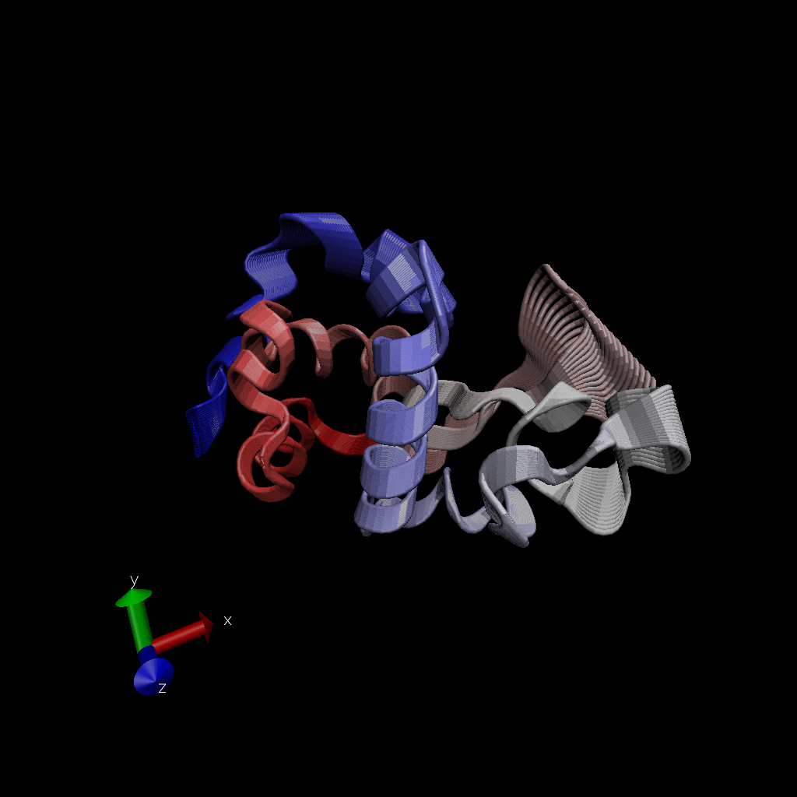
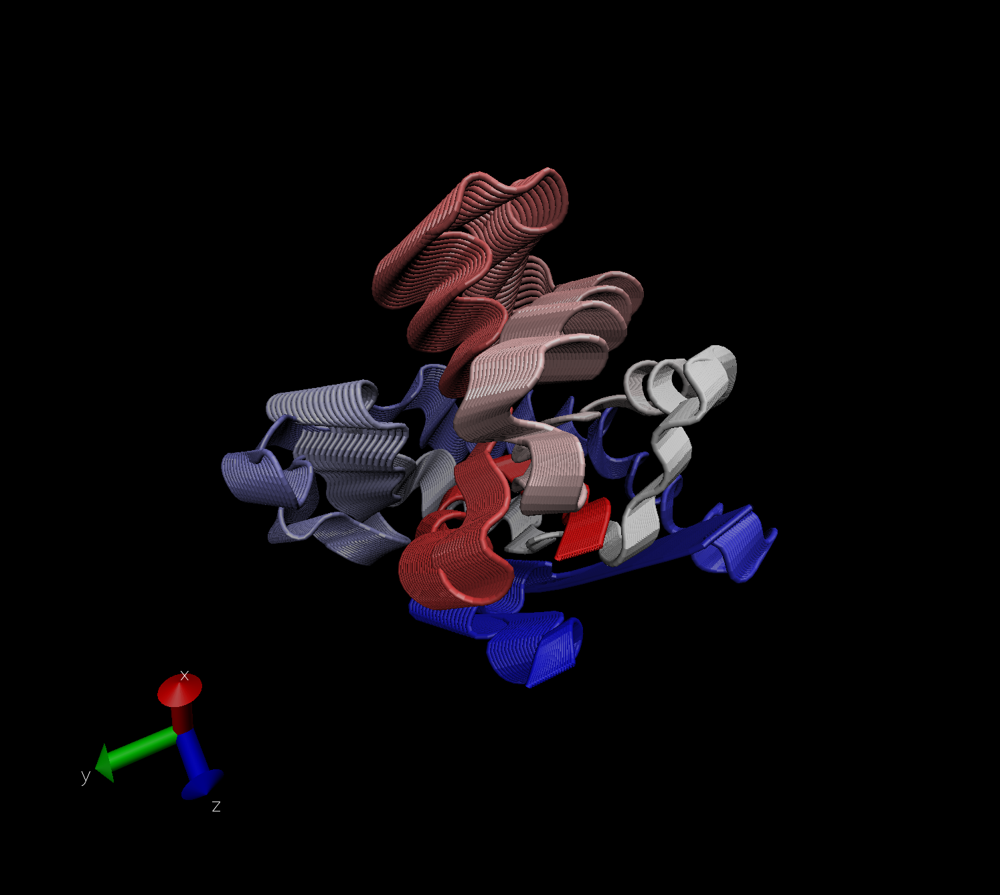

# Import PDB data

```{r}
pdb_stats <- read.csv("./Data Export Summary.csv", row.names=1)
pdb_stats
```

> Q1: What percentage of structures in the PDB are solved by X-Ray and Electron Microscopy.

X ray: 87.53% Electron Microscopy: 4.95%

```{r}
# Find percentages separately 
sum(pdb_stats$X.ray)/ sum(pdb_stats$Total)
sum(pdb_stats$EM)/ sum(pdb_stats$Total)

# Complete across all columns (i.e. all structural types)
round(((colSums(pdb_stats)/sum(pdb_stats$Total)) *100), 2)
```

> Q2: What proportion of structures in the PDB are protein?

87.35%

```{r}
round(((pdb_stats$Total[1]/sum(pdb_stats$Total))*100), 2)

```

> Q3: Type HIV in the PDB website search box on the home page and determine how many HIV-1 protease structures are in the current PDB?

23409

# Use VMD to explore protein structure

Import protein structure 

>********** Q4: Water molecules normally have 3 atoms. Why do we see just one atom per water molecule in this structure?


>********** Q5: There is a conserved water molecule in the binding site. Can you identify this water molecule? What residue number does this water molecule have (see note below)?

# Using Bio3D in R for structural bioinformatics 
```{r}
library(bio3d)
pdb <- read.pdb("1hel")
pdb
head(pdb$atom)
```

Let's do a quick bioinformatics prediction of protein dynamics (flexibility). 

For this use the `nma()` function, which does Normal Analysis Mode

```{r}
modes <- nma(pdb)
plot(modes)

```

Make a trajectory of this prediction with the `mktrj()`. 

```{r}
mktrj(modes, file="nma.pdb")
```
Display the image from VMD


# Comparative analysis: 
# Searching PDB for structures based on protein sequence

Sequence -> PDB -> Structures -> MSA (multiple structure alignment. can also be multiple sequence alignment for other applications) -> PCA

Start by getting sequence of interest
```{r}
aa <- get.seq("1AKE_A")
aa

# search pdb (the main database for experimental structures) for sequences comparative to my aa
blast <- blast.pdb(aa)

hits <- plot(blast)

```
Now I have my top hits from the search of the PDB. Now grab the sequence identifiers 

```{r}
hits$pdb.id
```
Download all the similar structures in the PDB and store them on our computer 

```{r}
# Download related PDB files
files <- get.pdb(hits$pdb.id, path="pdbs", split=TRUE, gzip=TRUE)
```

Now, we can align all of the comparative structures to our query protein 

```{r}
# Align releated PDBs
pdbs <- pdbaln(files, fit = TRUE)
```

# Plot alignments 
```{r}
# Vector containing PDB codes for figure axis
ids <- basename.pdb(pdbs$id)

# Draw schematic alignment
plot(pdbs, labels=ids)
```
# PCA

We will complete a PCA on the XYZ coordinate data of all structures (within `pdbs` object) with the `PCA()` function in bio3d
```{r}
pc <- pca(pdbs)
plot(pc)
```

Next, visualize the displacements (i.e. the movements of the structure) that are captured by PC1

```{r}
mktrj(pc, pc=1, file="pca.pdb")
```


```{r}
#Let's save our important results 
save(blast, hits, pca, pdbs, file="./my_results.RData")

```


# On another note.... look up predicted AlphaFold structure of your "find a gene"  protein. 

Predicted structure of Ileal Bile Acid Transporter: 


```{r}

```


