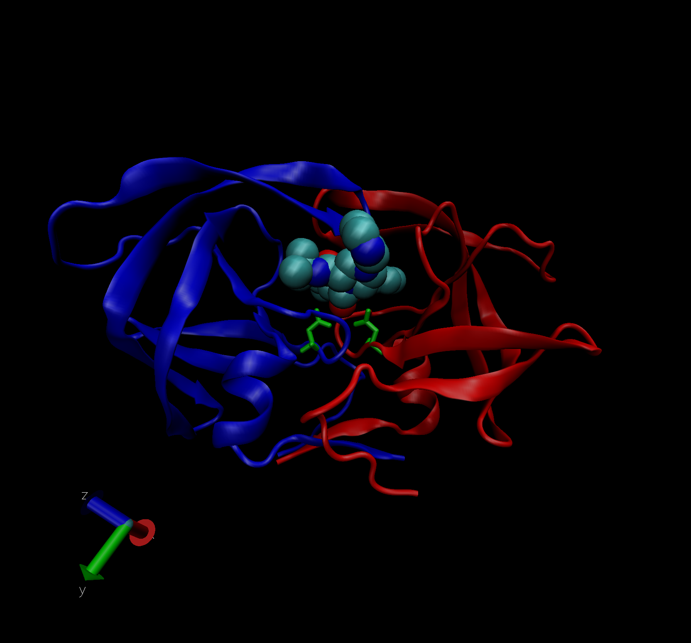

# Import PDB data

```{r}
pdb_stats <- read.csv("./Data Export Summary.csv", row.names=1)
pdb_stats
```

> Q1: What percentage of structures in the PDB are solved by X-Ray and Electron Microscopy.

X ray: 87.53% Electron Microscopy: 4.95%

```{r}
# Find percentages separately 
sum(pdb_stats$X.ray)/ sum(pdb_stats$Total)
sum(pdb_stats$EM)/ sum(pdb_stats$Total)

# Complete across all columns (i.e. all structural types)
round(((colSums(pdb_stats)/sum(pdb_stats$Total)) *100), 2)
```

> Q2: What proportion of structures in the PDB are protein?

87.35%

```{r}
round(((pdb_stats$Total[1]/sum(pdb_stats$Total))*100), 2)

```

> Q3: Type HIV in the PDB website search box on the home page and determine how many HIV-1 protease structures are in the current PDB?

23409

# Use VMD to explore protein structure

Import protein structure 

> Q4: Water molecules normally have 3 atoms. Why do we see just one atom per water molecule in this structure?


> Q5: There is a conserved water molecule in the binding site. Can you identify this water molecule? What residue number does this water molecule have (see note below)?

# Using Bio3D in R for structural bioinformatics 
```{r}
library(bio3d)
pdb <- read.pdb("1hel")
pdb
pdb$atom

m <- nma(pdb)
plot(m)

mktrj(m, file="nma.pdb")
```

