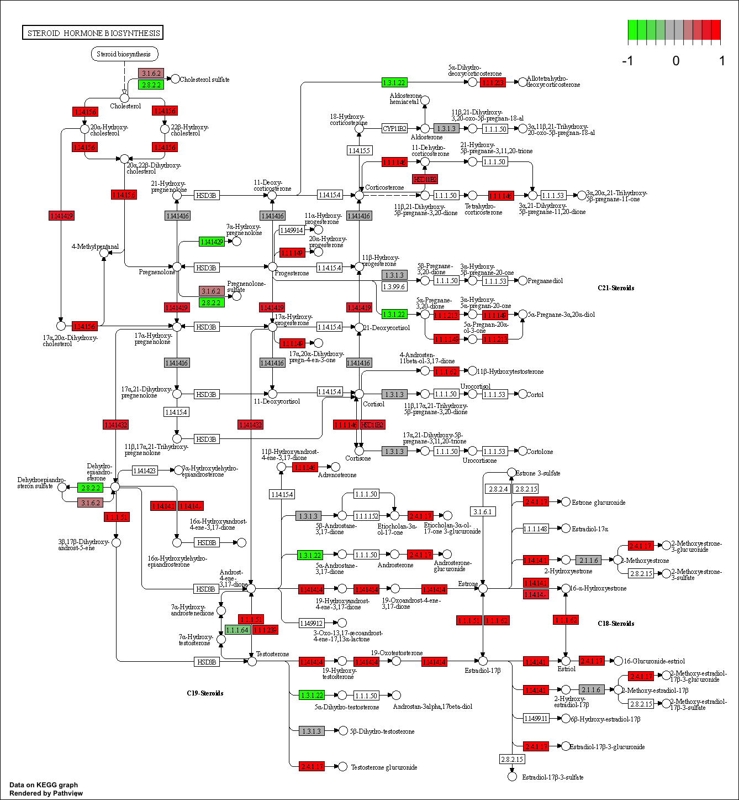
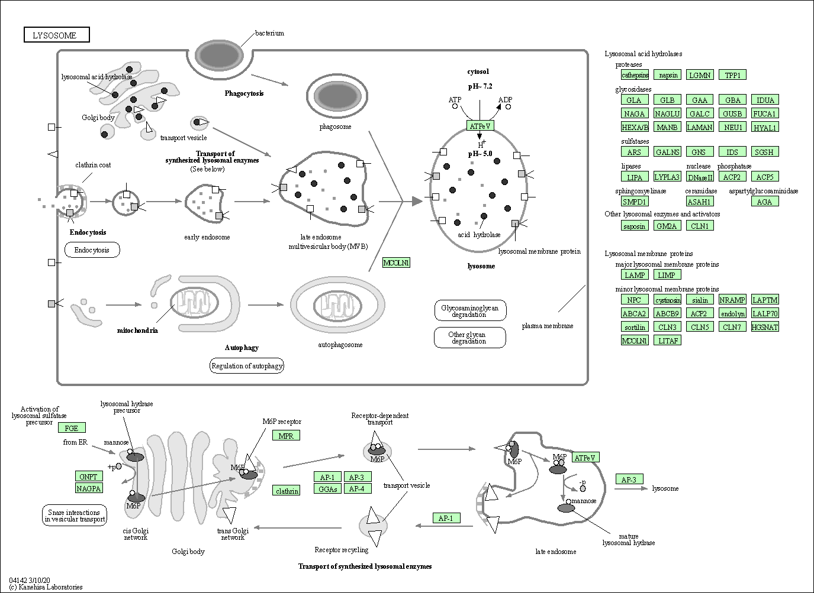
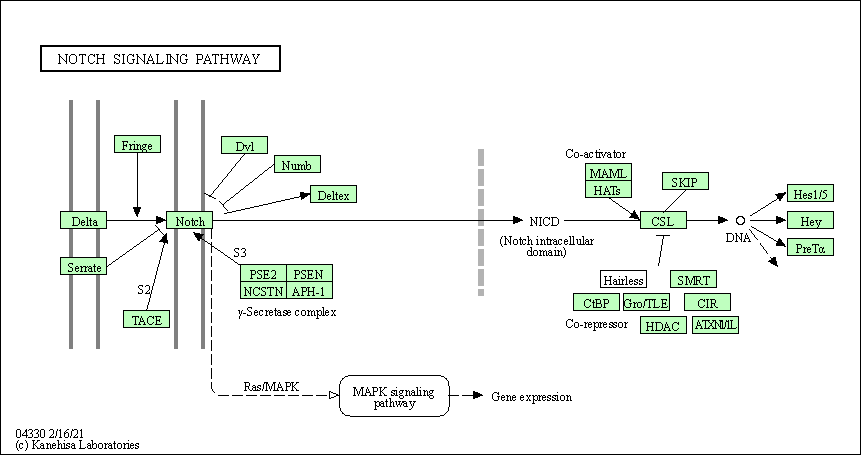

The data for today's mini project comes from the following publication: 

Trapnell C, Hendrickson DG, Sauvageau M, Goff L et al. "Differential analysis of gene regulation at transcript resolution with RNA-seq". Nat Biotechnol 2013 Jan;31(1):46-53. PMID: 23222703

### Workflow: 

* Import counts data and metadata
* PCA analysis 
* DESEQ analysis 
* Volcano plot
* Annotation 
* Pathway analysis 

```{r}
# Load packages
library(DESeq2)
library(ggplot2)
library(AnnotationDbi)
#Import metadata and counts table
mdat <- read.csv("./GSE37704_metadata.csv")
head(mdat)

counts <- read.csv("./GSE37704_featurecounts.csv", row.names = 1)
head(counts)
```
# Modify counts table to remove "length" column 
```{r}
counts <- as.matrix(counts[,2:7])
head(counts)
```
# Remove zeros from the counts table

```{r}
counts = counts[(rowSums(counts)!=0), ]
head(counts)
nrow(counts)
```
# PCA 
```{r}
# Run PCA on counts data 
pca <- prcomp(t(counts))
summary(pca)

# Save PCA values for graphing in dataframe
pca.data <- data.frame(pca$x)

# Generate plot
ggplot(pca.data, aes(PC1, PC2, col=mdat$condition)) +
  geom_point()

# How to plot using base R:
#plot(pca$x[,1], pca$x[,2], pch=16, col=as.factor(mdat$condition))

```
# DESEQ2 Analysis 
```{r}
dds = DESeqDataSetFromMatrix(countData=counts,
                             colData=mdat,
                             design=~condition)
dds = DESeq(dds)

dds
```
# Store dds results
```{r}
res <- results(dds, alpha= 0.05)
head(res)
summary(res)

```
# Visualize DESEQ2 results with volcano plot
```{r}
plot(res$log2FoldChange, -log(res$padj) )

# Make a color vector for all genes
mycols <- rep("gray", nrow(res) )

# Color red the genes with absolute fold change above 2
mycols[ abs(res$log2FoldChange) > 2 ] <- "red"

# Color blue those with adjusted p-value less than 0.01
#  and absolute fold change more than 2
inds <- (res$padj < 0.01) & (abs(res$log2FoldChange) > 2 )
mycols[ inds ] <- "blue"
plot( res$log2FoldChange, -log(res$padj), col=mycols, xlab="Log2(FoldChange)", ylab="-Log(P-value)")
```

# Annotation 
Add SYMBOL, ENTREZID, and GENENAME annotation to results table for downstream KEGG analysis 

```{r}
library("org.Hs.eg.db")

res$symbol <- mapIds(org.Hs.eg.db, # Annotation package
                     keys=row.names(res), # Our genenames
                     keytype="ENSEMBL",        # The format of our genenames
                     column="SYMBOL",          # The new format we want to add
                     multiVals="first")

res$entrez <- mapIds(org.Hs.eg.db, # Annotation package
                     keys=row.names(res), # Our genenames
                     keytype="ENSEMBL",        # The format of our genenames
                     column="ENTREZID",          # The new format we want to add
                     multiVals="first")

res$genenames <-mapIds(org.Hs.eg.db, # Annotation package
                     keys=row.names(res), # Our genenames
                     keytype="ENSEMBL",        # The format of our genenames
                     column="GENENAME",          # The new format we want to add
                     multiVals="first")

head(res, 10)
```
# Write results to file

```{r}
# Reorder by adjusted p-value and write to local directroy 
res = res[order(res$pvalue),]
write.csv(res, file="./deseq_results.csv")
```

# Pathway Ananlysis 
```{r}
# Load packages 
library(pathview)
library(gage)
library(gageData)

data(kegg.sets.hs)
data(sigmet.idx.hs)

# Focus on signaling and metabolic pathways only
kegg.sets.hs = kegg.sets.hs[sigmet.idx.hs]

# Examine the first 3 pathways
head(kegg.sets.hs, 3)

```

```{r}
# Create named vector of fold changes for input to gauge function
foldchanges <-  res$log2FoldChange
names(foldchanges) <- res$entrez
head(foldchanges)
```
```{r}
# Run Pathview
keggres = gage(foldchanges, gsets=kegg.sets.hs)

# Look at object returned from gauge
attributes(keggres)

# Look at the first few down pathways
head(keggres$less)

# Look at the first few up pathways
head(keggres$greater)
```
```{r}
# Investigate top "up" pathway with pathview()
pathview(gene.data=foldchanges, pathway.id="hsa04640")
```


```{r}
# Generate visualization with the top 5 upregulated pathways
keggrespathways <- rownames(keggres$greater)[1:5]

# Extract the 8 character long IDs part of each string
keggresids = substr(keggrespathways, start=1, stop=8)
keggresids

# Draw plots
pathview(gene.data=foldchanges, pathway.id=keggresids, species="hsa")
```




 

```{r}
# Can also complete the same steps for the top 5 down regulated pathways
#keggrespathways <- rownames(keggres$less)[1:5]

# Extract the 8 character long IDs part of each string
#keggresids = substr(keggrespathways, start=1, stop=8)
#keggresids

# Draw plots
#pathview(gene.data=foldchanges, pathway.id=keggresids, species="hsa")
```

# Gene Ontology (GO)

Repeat for gene ontology biological process 

```{r}
data(go.sets.hs)
data(go.subs.hs)

# Focus on Biological Process subset of GO
gobpsets = go.sets.hs[go.subs.hs$BP]

gobpres = gage(foldchanges, gsets=gobpsets, same.dir=TRUE)

lapply(gobpres, head)

# Could graph gobpres results and create visualizations if desired...
```

# Reactome

Conduct over-representation enrichment analysis and pathway-topology analysis with Reactome
```{r}
# Create list of significant genes at alpha=0.05
sig_genes <- res[res$padj <= 0.05 & !is.na(res$padj), "symbol"]
print(paste("Total number of significant genes:", length(sig_genes)))

write.table(sig_genes, file="significant_genes.txt", row.names=FALSE, col.names=FALSE, quote=FALSE)
```
 > Q: What pathway has the most significant “Entities p-value”? Do the most significant pathways listed match your previous KEGG results? What factors could cause differences between the two methods?
 
 "Endosomal/Vacuolar pathway". No, it is not the same. Although there is some overlap, the differences between the two methods may result from the database being used to search terms. Also, the goals of the two analyses have different end goals. 

