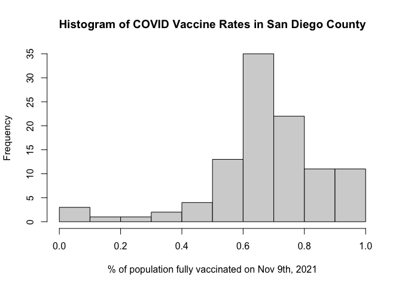
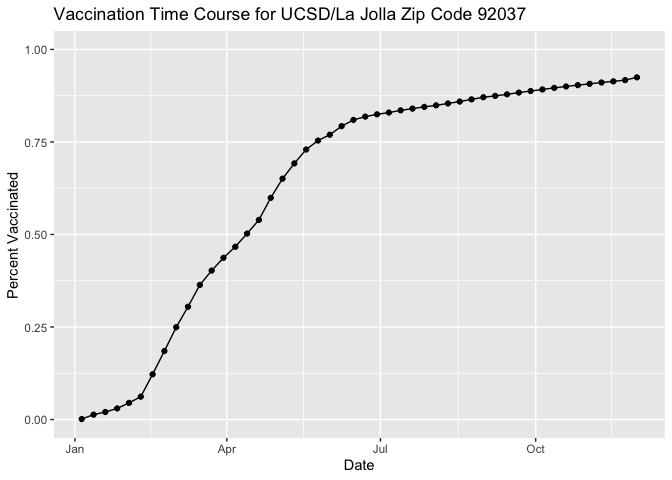
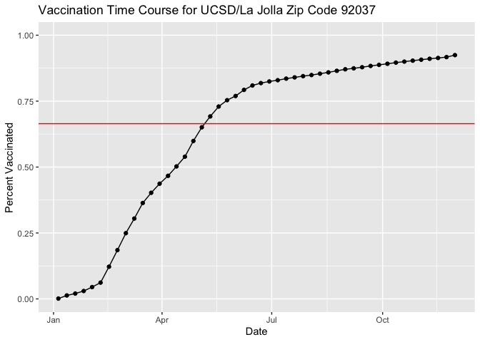
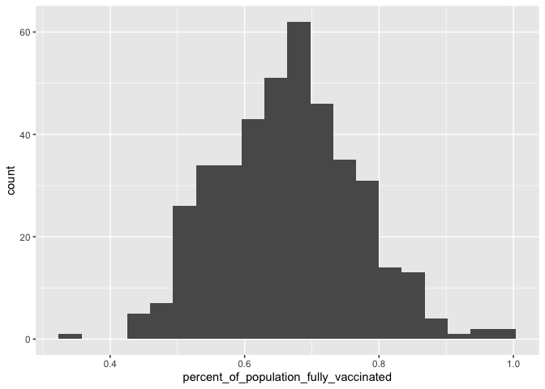
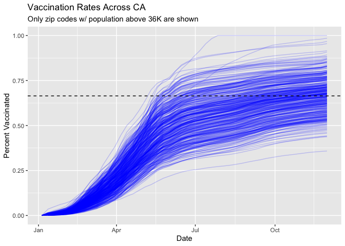

Covid\_vaccination\_rates
================
Kelly\_F
12/3/2021

# Import Vaccination Data

Import CA data on COVID vaccines administered by zipcode from:
<https://data.ca.gov/dataset/covid-19-vaccine-progress-dashboard-data-by-zip-code/resource/15702a90-aa5d-49bc-8621-a8129630725a>

NOTE: answers in this lab report may differ from answer key on lab walk
through b/c data has been updated since last week as of 11/30/21.

``` r
# Import CSV
vax <- read.csv("./covid19vaccinesbyzipcode_test.csv", header = TRUE)
head(vax)
```

    ##   as_of_date zip_code_tabulation_area local_health_jurisdiction       county
    ## 1 2021-01-05                    92091                 San Diego    San Diego
    ## 2 2021-01-05                    92116                 San Diego    San Diego
    ## 3 2021-01-05                    95360                Stanislaus   Stanislaus
    ## 4 2021-01-05                    94564              Contra Costa Contra Costa
    ## 5 2021-01-05                    95501                  Humboldt     Humboldt
    ## 6 2021-01-05                    95492                    Sonoma       Sonoma
    ##   vaccine_equity_metric_quartile                 vem_source
    ## 1                              4    CDPH-Derived ZCTA Score
    ## 2                              3 Healthy Places Index Score
    ## 3                              1 Healthy Places Index Score
    ## 4                              4 Healthy Places Index Score
    ## 5                              2 Healthy Places Index Score
    ## 6                              4 Healthy Places Index Score
    ##   age12_plus_population age5_plus_population persons_fully_vaccinated
    ## 1                1238.3                 1303                       NA
    ## 2               30255.7                31673                       45
    ## 3               10478.5                12301                       NA
    ## 4               17033.0                18381                       NA
    ## 5               20566.6                22061                       NA
    ## 6               25076.9                28024                       NA
    ##   persons_partially_vaccinated percent_of_population_fully_vaccinated
    ## 1                           NA                                     NA
    ## 2                          898                               0.001421
    ## 3                           NA                                     NA
    ## 4                           NA                                     NA
    ## 5                           NA                                     NA
    ## 6                           NA                                     NA
    ##   percent_of_population_partially_vaccinated
    ## 1                                         NA
    ## 2                                   0.028352
    ## 3                                         NA
    ## 4                                         NA
    ## 5                                         NA
    ## 6                                         NA
    ##   percent_of_population_with_1_plus_dose
    ## 1                                     NA
    ## 2                               0.029773
    ## 3                                     NA
    ## 4                                     NA
    ## 5                                     NA
    ## 6                                     NA
    ##                                                                redacted
    ## 1 Information redacted in accordance with CA state privacy requirements
    ## 2                                                                    No
    ## 3 Information redacted in accordance with CA state privacy requirements
    ## 4 Information redacted in accordance with CA state privacy requirements
    ## 5 Information redacted in accordance with CA state privacy requirements
    ## 6 Information redacted in accordance with CA state privacy requirements

> Q1. What column details the total number of people fully vaccinated?

``` r
head(vax$persons_fully_vaccinated)
```

    ## [1] NA 45 NA NA NA NA

> Q2. What column details the Zip code tabulation area?

``` r
head(vax$zip_code_tabulation_area)
```

    ## [1] 92091 92116 95360 94564 95501 95492

> Q3. What is the earliest date in this dataset? “2021-01-05”

``` r
head(vax$as_of_date)
```

    ## [1] "2021-01-05" "2021-01-05" "2021-01-05" "2021-01-05" "2021-01-05"
    ## [6] "2021-01-05"

> Q4. What is the latest date in this dataset? “2021-11-30”. Note, this
> differs from lab report solutions because the dataset has been updated
> since 11/24 when class was held.

``` r
dim(vax)
```

    ## [1] 84672    14

``` r
vax$as_of_date[84672]
```

    ## [1] "2021-11-30"

# Look at overview of df

``` r
# Install and load Skimr package
#install.packages("skimr")
library(skimr)

#skimr::skim(vax)
```

> Q5. How many numeric columns are in this dataset? 9

> Q6. Note that there are “missing values” in the dataset. How many NA
> values there in the persons\_fully\_vaccinated column? 8472. This
> numer was taken from the skimr report, from the “n\_missing” column.
> Note, this differs from lab report solutions because the dataset has
> been updated since 11/24 when class was held.

> Q7. What percent of persons\_fully\_vaccinated values are missing (to
> 2 significant figures)? 10.01 %

``` r
# Find dimension of data frame
dim(vax)
```

    ## [1] 84672    14

``` r
# Divide # of missing values for persons_fully_vaccinated by number of columns
round(((8472/84672)*100), 2)
```

    ## [1] 10.01

# Working with Dates

We need to change dates in our vax$as\_of\_date column to useful format
using the lubridate package so that we can work with our data in R

``` r
library(lubridate)
```

    ## 
    ## Attaching package: 'lubridate'

    ## The following objects are masked from 'package:base':
    ## 
    ##     date, intersect, setdiff, union

``` r
# Specify that we are using the year-month-day format
vax$as_of_date <- ymd(vax$as_of_date)
```

> How many days have passed since the first vaccination reported in this
> dataset?

``` r
# Now that dates have been reformatted, we can now do math with our as_of_date column 

today() - vax$as_of_date[1]
```

    ## Time difference of 332 days

> how many days does the the dataset span?

``` r
vax$as_of_date[nrow(vax)] - vax$as_of_date[1]
```

    ## Time difference of 329 days

> Q9. How many days have passed since the last update of the dataset? 3
> days

``` r
today()- vax$as_of_date[nrow(vax)]
```

    ## Time difference of 3 days

> Q10. How many unique dates are in the dataset (i.e. how many different
> dates are detailed)? 48

``` r
length(unique(vax$as_of_date))
```

    ## [1] 48

# Working with Zip Codes

Will be using zipcodeR package to make working with zip codes easier

``` r
# install.packages("zipcodeR")
library(zipcodeR)
```

Note: reverse\_zipcode function, which gathers census data, can be used
to investigate if various soceioeconomic factors correlate with
vaccination rates

``` r
# Calculate the distance between the centroids of two zip codes. E.g.: 
zip_distance('92037','92109')
```

    ##   zipcode_a zipcode_b distance
    ## 1     92037     92109     2.33

``` r
# Pull census data for the following zip codes
reverse_zipcode(c('92037', "92109") )
```

    ## # A tibble: 2 × 24
    ##   zipcode zipcode_type major_city post_office_city common_city_list county state
    ##   <chr>   <chr>        <chr>      <chr>                      <blob> <chr>  <chr>
    ## 1 92037   Standard     La Jolla   La Jolla, CA           <raw 20 B> San D… CA   
    ## 2 92109   Standard     San Diego  San Diego, CA          <raw 21 B> San D… CA   
    ## # … with 17 more variables: lat <dbl>, lng <dbl>, timezone <chr>,
    ## #   radius_in_miles <dbl>, area_code_list <blob>, population <int>,
    ## #   population_density <dbl>, land_area_in_sqmi <dbl>,
    ## #   water_area_in_sqmi <dbl>, housing_units <int>,
    ## #   occupied_housing_units <int>, median_home_value <int>,
    ## #   median_household_income <int>, bounds_west <dbl>, bounds_east <dbl>,
    ## #   bounds_north <dbl>, bounds_south <dbl>

# Focus on the San Diego Area

``` r
# Subset to San Diego county only areas using base R
sd <- vax[ vax$county == "San Diego", ]

# Alternatively, we could have subset to San Diego using dplyr: 
library(dplyr)
```

    ## 
    ## Attaching package: 'dplyr'

    ## The following objects are masked from 'package:stats':
    ## 
    ##     filter, lag

    ## The following objects are masked from 'package:base':
    ## 
    ##     intersect, setdiff, setequal, union

``` r
#sd <- filter(vax, county == "San Diego")

nrow(sd)
```

    ## [1] 5136

> Q11. How many distinct zip codes are listed for San Diego County? 107

``` r
length(unique(sd$zip_code_tabulation_area))
```

    ## [1] 107

> Q12. What San Diego County Zip code area has the largest 12 +
> Population in this dataset? 92154

``` r
sd$zip_code_tabulation_area[which.max(sd$age12_plus_population)]
```

    ## [1] 92154

Using dplyr select all San Diego “county” entries on “as\_of\_date”
“2021-11-09” and use this for the following questions.

``` r
# Data on as of date nov 9th
sd_nov_9 <- filter(sd, as_of_date == "2021-11-09")
```

> Q13. What is the overall average “Percent of Population Fully
> Vaccinated” value for all San Diego “County” as of “2021-11-09”?
> 67.41%

``` r
round((mean(sd_nov_9$percent_of_population_fully_vaccinated, na.rm=TRUE)*100), 2)
```

    ## [1] 67.41

> Q14. Using either ggplot or base R graphics make a summary figure that
> shows the distribution of Percent of Population Fully Vaccinated
> values as of “2021-11-09”?

``` r
hist(sd_nov_9$percent_of_population_fully_vaccinated, 
     main="Histogram of COVID Vaccine Rates in San Diego County",
        xlab="% of population fully vaccinated on Nov 9th, 2021")
```

<!-- -->

# Focus on UCSD/La Jolla

UCSD area code is 92037

``` r
# Filter to UCSD data
ucsd <- filter(sd, zip_code_tabulation_area=="92037")
```

> Q15. Using ggplot make a graph of the vaccination rate time course for
> the 92037 ZIP code area:

``` r
library(ggplot2)

# Graph time course of vaccination rate for UCSD
ggplot(ucsd) +
  aes(x= as_of_date, y= percent_of_population_fully_vaccinated) +
  geom_point() +
  geom_line(group=1) +
  ylim(c(0,1)) +
  labs(x="Date", y="Percent Vaccinated", 
       title= "Vaccination Time Course for UCSD/La Jolla Zip Code 92037")
```

<!-- -->
\# Comparing La Jolla/UCSD to similar sized areas

Compare to area codes with similarly sized population.

Go back to the original dataset and compare to area codes that have a
population at least as large as La Jolla

``` r
# Subset to all CA areas with a population as large as 92037
vax.36 <- filter(vax, age5_plus_population > 36144 &
                as_of_date == "2021-11-16")

head(vax.36)
```

    ##   as_of_date zip_code_tabulation_area local_health_jurisdiction         county
    ## 1 2021-11-16                    92345            San Bernardino San Bernardino
    ## 2 2021-11-16                    92553                 Riverside      Riverside
    ## 3 2021-11-16                    92058                 San Diego      San Diego
    ## 4 2021-11-16                    91786            San Bernardino San Bernardino
    ## 5 2021-11-16                    92507                 Riverside      Riverside
    ## 6 2021-11-16                    93021                   Ventura        Ventura
    ##   vaccine_equity_metric_quartile                 vem_source
    ## 1                              1 Healthy Places Index Score
    ## 2                              1 Healthy Places Index Score
    ## 3                              1 Healthy Places Index Score
    ## 4                              2 Healthy Places Index Score
    ## 5                              1 Healthy Places Index Score
    ## 6                              4 Healthy Places Index Score
    ##   age12_plus_population age5_plus_population persons_fully_vaccinated
    ## 1               66047.5                75539                    35432
    ## 2               61770.8                70472                    37411
    ## 3               34956.0                39695                    14023
    ## 4               45602.3                50410                    30834
    ## 5               51432.5                55253                    31939
    ## 6               32753.7                36197                    24918
    ##   persons_partially_vaccinated percent_of_population_fully_vaccinated
    ## 1                         4389                               0.469056
    ## 2                         4846                               0.530863
    ## 3                         2589                               0.353269
    ## 4                         3132                               0.611664
    ## 5                         3427                               0.578050
    ## 6                         2012                               0.688400
    ##   percent_of_population_partially_vaccinated
    ## 1                                   0.058102
    ## 2                                   0.068765
    ## 3                                   0.065222
    ## 4                                   0.062131
    ## 5                                   0.062024
    ## 6                                   0.055585
    ##   percent_of_population_with_1_plus_dose redacted
    ## 1                               0.527158       No
    ## 2                               0.599628       No
    ## 3                               0.418491       No
    ## 4                               0.673795       No
    ## 5                               0.640074       No
    ## 6                               0.743985       No

> Q16. Calculate the mean “Percent of Population Fully Vaccinated” for
> ZIP code areas with a population as large as 92037 (La Jolla)
> as\_of\_date “2021-11-16”. Add this as a straight horizontal line to
> your plot from above with the geom\_hline() function?

``` r
mean_pop <- mean(vax.36$percent_of_population_fully_vaccinated)

# Add mean_pop to ggplot graph of vaccination timecourse for UCSD/LA Jolla county

ggplot(ucsd) +
  aes(x= as_of_date, y= percent_of_population_fully_vaccinated) +
  geom_point() +
  geom_line(group=1) +
  geom_hline(yintercept = mean_pop, color="red")+
  ylim(c(0,1)) +
  labs(x="Date", y="Percent Vaccinated", 
       title= "Vaccination Time Course for UCSD/La Jolla Zip Code 92037")
```

<!-- -->
&gt; Q17. What is the 6 number summary (Min, 1st Qu., Median, Mean, 3rd
Qu., and Max) of the “Percent of Population Fully Vaccinated” values for
ZIP code areas with a population as large as 92037 (La Jolla)
as\_of\_date “2021-11-16”?

``` r
summary(vax.36$percent_of_population_fully_vaccinated)
```

    ##    Min. 1st Qu.  Median    Mean 3rd Qu.    Max. 
    ##  0.3533  0.5910  0.6669  0.6645  0.7311  1.0000

> Q18. Using ggplot generate a histogram of this data.

``` r
ggplot(vax.36,
       aes(percent_of_population_fully_vaccinated))+ 
  geom_histogram(bins=20)
```

<!-- -->
&gt; Q19. Is the 92109 and 92040 ZIP code areas above or below the
average value you calculated for all these above? The average % of
population fully vaccinated for area codes w/ a population at least as
large as san diego on 11/16/21 is 66.45%. Based on this, 92040 area code
has a lower than average vaccination rate (\~52%), and 92109 has an
above average vaccination rate (\~69%).

``` r
# % fully vaccinated for 92040 on 11/16/21
vax %>% filter(as_of_date == "2021-11-16") %>%  
  filter(zip_code_tabulation_area=="92040") %>%
  select(percent_of_population_fully_vaccinated)
```

    ##   percent_of_population_fully_vaccinated
    ## 1                                0.52142

``` r
# % fully vaccinated for 92109 on 11/16/21
vax %>% filter(as_of_date == "2021-11-16") %>%  
  filter(zip_code_tabulation_area=="92109") %>%
  select(percent_of_population_fully_vaccinated)
```

    ##   percent_of_population_fully_vaccinated
    ## 1                                0.68912

> Q20. Finally make a time course plot of vaccination progress for all
> areas in the full dataset with a age5\_plus\_population &gt; 36144.

``` r
# Subset data to populations larger than 36K
vax.36.all <- filter(vax, age5_plus_population > 36144)

# Plot vaccine timecourse for all area codes. 
ggplot(vax.36.all) +
  aes(x=as_of_date,
      y=percent_of_population_fully_vaccinated, 
      group=zip_code_tabulation_area) +
  geom_line(alpha=0.2, color="blue") +
  ylim(0,1) +
  labs(x="Date", y="Percent Vaccinated",
       title="Vaccination Rates Across CA",
       subtitle="Only zip codes w/ population above 36K are shown") +
  geom_hline(yintercept = mean_pop, linetype=2)
```

    ## Warning: Removed 177 row(s) containing missing values (geom_path).

<!-- -->
&gt; Q21. How do you feel about traveling for Thanksgiving and meeting
for in-person class next Week? About as good as I can given the
circumstances… :D
